# Introduction to Programming
## What is programming? 
It is the process of preparing an instructional program for a device. It is attempting to get a computer to complete its specific task without making mistakes.

Computers are only smart because we program them to be, which means what information we feed to our computer, they are only smart on that information.

Computers only understand **machine code**. A machine code is a series of 1's and 0's or so called a binary, fed and interpreted by the computer. This is the only way computer can read instructions.

It would be entirely unpractical to convert every programming instructions you written into binary by hand, but it is possible to do it with programming languages and a compiler.

## Programming Languages
Programming languages serve as a middle-man for translating your instruction into **machine code**, and it is very useful for programmers. This is easy to learn for humans to learn than **machine code**.

There are many programming languagues that serves different purposes, languages such as **C#, Java, and Python** are a general purposes languages, **C, C++, and Rust** designed for systems programming.

Each language also have a **power** or **level**, basically how similar it is to machine code, or are closer to the hardware. The lower the level, the more similar to machine code.

+ Low-Level programming languages
+ + **Assembly, or C**

+ High-Level programming langugaes
+ + **Java, C# or Python**

Each language has other minor differences, explore to find one which you like since there are thousands of programming languages, but most of them can accomplish similar task.

## How do we write code?
You cannot simply type words into a text document, and expecte that the computer is able to carry out a specific task you've written.

To properly send instructions to the computer, we need **programming languages**. But we also cannot type in a certain language and expect the same thing.

We use a **compiler** for a certain languages such as **C++, Java, or C#**, or an IDE (Integrated Development Environments) which contains tools such as **compilers**, and auto-completion that you would need to writing a code, building, and running the program.

**Compilers**
Compilers are a program that compiled our written code into bytecode or a machine code. 
+ A byte code is similar to machine code except it is specific to other languages, such as **Java, or C#**. It convert our code into a intermediate language that would also be translated into machine code later at runtime.

**IDEs**
IDEs are like any other program on your computer except it's used for the facilitation of code. IDEs has a graphical interface that helps programmers to build, run, and debug the code by just pressing a single button.
+ Examples (NetBeans, IntelliJ, Visual Studio)

In addition to a place to write, IDE's also include
+ Built in **Error-checking** for when the code is incorrect.
+ **Auto-completion** for automatically completing the word without having to write it manually.
+ Project hierarchy that helps you manage and organize your code.

// Images of how IDE looks like

## Syntaxes
Each language has its own set of rules, set of syntax you must follow. You cannot simply just type anything in the code, convert it to machine code and expect the computer to understand it. You need **syntax**.

Learning a programming language can be similar to learning a real language.
+ All programming languages have a **set of rules** you must follow when writing code. In other words, it is called **syntax**.
+ Similar to **grammar** in real life languages.

**What is a syntax?**

It is a rules you must follow if you want your program to run correctly. Syntax for each programming language is **different** and **unique**. Breaking programming language's rules will result into an compilation **error**, preventing you to build or run the program.

Example of initializing a variables in 3 different languages:

**Java**
In **Java**, we must specify the type of a variable we are defining, and must add a semicolon at the end of a line.
```java
int x = 10;
```

**Python**
In **Python**, we just type the name and what value is stored to, it doesn't need to know what type it is.
```python
x = 10
```

**JavaScript**
In **JavaScript**, it is similar to python, except we need to put **let** keyword if the value subject to change, or **const** if the value will never change. The semicolons are optional in **JavaScript**.
```javascript
let x = 10
```

As you can see in the examples, **syntax matters** when learning when learning a new language. The goal of the program was the same, but all three languages shown took a different approaches.

If you forgot to put one semicolon, or misplace a character, the entire program will not run or compile and send you back a **syntax error**.

Another cool thing about IDEs is that it will let you know if and when there are **syntax errors** in your code. Usually with underlined in red and it won't let your program to build or run until the program has been fixed.

// Show some image examples of what we're talking about

## How do we get Information or an output from computers?
**Console**, programmers keep track of their progress by looking at the console. It is a text interface within the computer that programmers can use for a variety of purposes, whether to output something on the screen, or to make a user input.

// Picture of a console application

The main use of the **console** is to output text from the **program** using **code**.

```python
print("Hello World")
```

// Picture of Hello World in console application

Print function is used for viewing and interpreting the computer's output from a program. 

Example, computing 4+3 will print nothing to the console.
// Some blank output on a console application

Example, computing 4+3 then **printing** it will print 7 to the **console**.
// 7 printed on the console

The print statement will vary depending on the language.

Example Java code for outputting a text to a console. 
```java
class Program {
    public static void main(String[] args) {
        System.out.print("Hi");
        System.out.println("Hello World");
    } 
}
```

Another example but with a Python code.
```python
print("Hi")
print("Hello World\n")
```

The console is mainly a **Developer Tool**, not usually meant to be used and interacted by the end user except in a **very abstract cases**.

## What can computer can do?
### Math
The computer already knows how to do **simple arithmetic**. You will be able to print the result of any math operation using the `print()` function. May seem useless, but comes in handy **extremely often**.

The simple arithmetic are:
+ Addition: `+`
+ Substraction: `-`
+ Multiplication: `*`
+ Division: `/`

In addition to **simple arithmetic**, most programming languages included an additional math operator known as **modulus**. **Modulus** allows us to get the **remainder** of a divisional operation, represented with **%**.

Example, if we take **10 modulus 3 (or 10 % 3)**, the computers will give us the division remainder of these operation. The following output of the program will be **1**.

```python
print(10 % 3)
```

Output:
```
Console: 1
```

In this case where there **isn't a remainder**, the computer will simply give us **0**.


This is extremely useful when determining if a number is **even or odd**.
If a number modulo 2 is 0, the number is **even**.
If a number modulo 2 is 1, the number is **odd**.


### Strings
Strings are another way of representing a **text**.
+ "Hello World"
+ "A"
+ **Anything enclosed by a quotation marks**.

Example usage for that when the game is over.

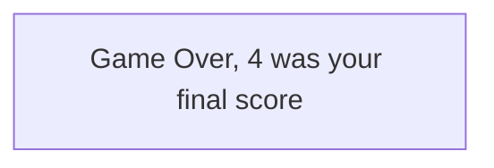
We could make it as a string as a exact phrase and print it out on the console.

```python
print("Game Over, 4 was your final score")
```
Great, but there is a problem on this code. We are not actually printing the actual score, but just printing a number `4` on it. To fix this, we can print our integer variable called `score` by joining our string with a number.

```python
score = 4
print("Game Over, " + score + " was your final score")
```
We can print multiple text by adding them or joining them together in a print function. It is also known as **concatenation**.

```
Console: Game over, 4 was your final score
```

We can also combine the previous example with math operation.

```python
print("Game Over, " + (score + 4) + " was your final score")
```

```
Console: Game over, 8 was your final score
```
Difference between "4" and 4:
+ 4 in quotation marks ("4") is treated as a **String**
+ 4 without quotation marks (4) is treated as an **Integer**

```
4 != "4"
```

## Variables
A variables is something that can store **information**, can be **referenced** and **modified**.

Each variable has a **type, a name, and a stored value** inside.

Many types of variables, but we will be focusing on common **data type variables**, which is **Integers, Booleans, Floats, Strings and Chars**.

+ Integer (int) - is a primitive type, can store numeric values, but it cannot store decimal values. It can hold from -2,147,483,648 to 2,147,483,648 number.
```
1, 4, 10, 342
```
+ Float (float) - is a primitive, floating point data type, can store numeric values, and can also store decimal values.
```
1.5f, 2, 13.5f
```
+ Boolean (bool) - is a primitive type, can only store a value of either **true** or **false**.
```java
true, false
```
+ String - is an another way of representing a **text**. Useful for displaying text and storing **input information**. Is also useful for outputting information in a readable format for the user.
```java
"Hello World", "Hi!", "Text"
```
+ Char (char) - is a primitive type, it stands as a **Character**. Each holds **one** character, enclosed with a **single-quotation** marks.
```java
'a', 'b', '#', 'c'
```

**Why variables are so useful?**
Often times you are going to want to keep track of things such as user's **name** or **score**. By creating a variable, you can store this information in that variable and then **reference**, **add too**, or **modify it**.

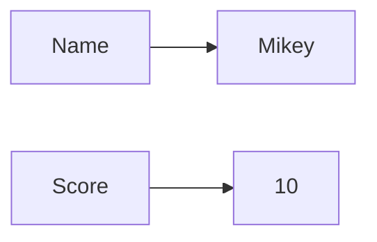
Other important uses for variables is taking input from the user. Making your program have **variability**. Manipulating variables is necessary for many tasks in programming.

## How do we manipulate variables?
Everytime we define or creates a variable, a variable and the value is stored in memory. The variable is always referencing the value it holds, so that we can easily access the value.

In this table, we have Name and Age variable defined in the memory. 

Name | Age
-----|-------
"Mike" | 18

If we defined something else like Location variable, the computer will store it in memory.

```java
String Location = "Bulacan"
```

Name | Age   | Location
-----|-------|----------
"Mike" | 18  | "Bulacan"

In some cases, you may put the variable **without any information inside of it**, or also called as a `null` values. The reason to do this is if you want **to store information in the variable later**.

If you ever tried to **reference** a variable without a value, it will result a **runtime error** or an **exception**, in this case a **NullPointerException**.

```java
String value = null;
```
We may also have a variable that point to a variable to access a value that the variable is pointing to.
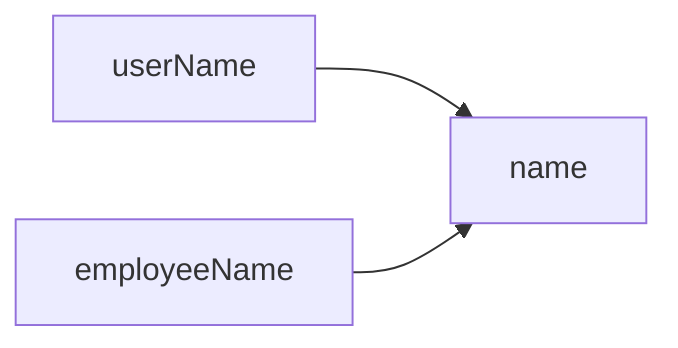

This doesn't also create a space in memory because we are just referencing another variable which has a value that already been created.

name | userName | employeeName
-----|----------|-------------
"Mike" | |

### Modify variables

**Variables are mutable** by default in most languages, it means we can modify or change any value that the variable holds for instance, if we want to change the value of the `score`, we simply just change it with a equal sign operator.

```java
int score = 10;
score = 10 + 10;
```
or better yet:
```java
int score = 10;
score += 10;
```

There are other ways to modify these values. Integer, and Float variable can be modify with any arithmetic operators. (Add, Subtract, Multiply, Divide, Modulo). String variable can be added or concatenated. 

### Naming variables
There is **one big rule** when naming variables, they must be continous and only contains one word. In this case, we cannot have a spaces when naming a variable.

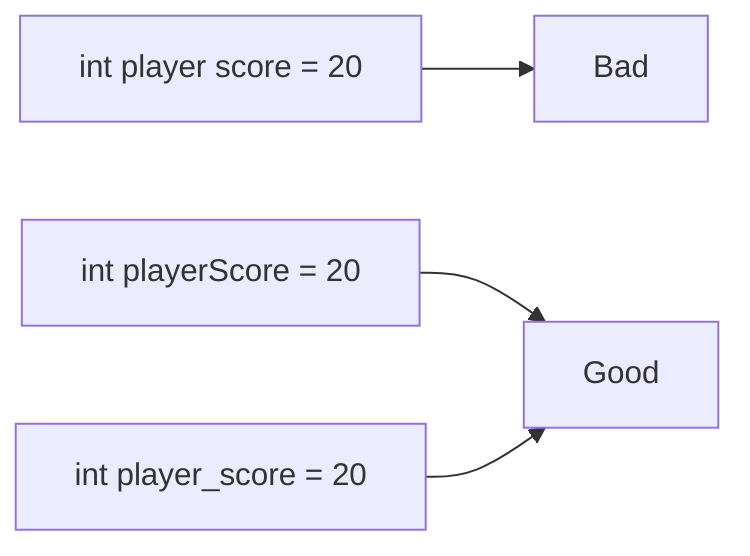

After the code has out of scope, the variables are deleted in memory. Unless if you run that code once again which the variable will lived once again.


# Conditional Statements
Depending on the certain conditions, we want our code to do different things.

### If statement

The most basic conditional statement is the If statement. (If something is True, otherwise do something else.)

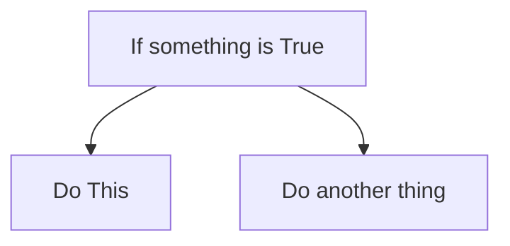

Most programming languages uses **parenthesis ()**, to cover the conditions in If statement which will be evaluated as boolean which is **true** or **false**.

If the statement is true, the code block that under it will be executed, **else** the another code block will be executed, or just do nothing (if there is no **else**).

```java
if (thingIsTrue) {
    /* Do this line of code */
} 
/* Then run any code under this */
```

Example with a given variables:
```java
if (score > 5) {
    System.out.println("Good job! Nice score!");
}
```

### Else-if Statement
The Else-if statement will only be evaluated if the preceding if (or if-else) statement was evaluated, but returned as false.

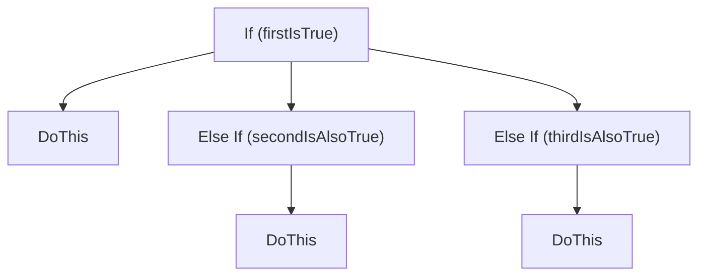

```java
if (score < 10) {
    /* Do This */
} else if (score < 20) {
    /* Do This */
} else if (score < 40) {
    /* Do This */
} 
/* Then run any code under this */
```

Check the initial statement, if it's true, we run that block of code, if it's false, we move on to any else if statements and evaluate the conditions. If any of them are true, run that block of code and move on.


### Else Statement
The else statement comes after if/if-else statement and **will always** carry out instructions, if all previous cases are not true.

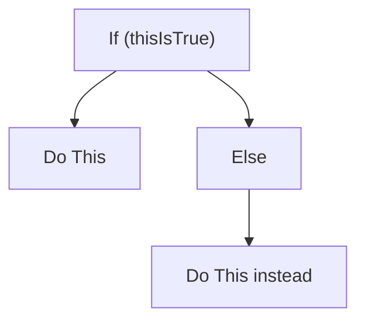

```java
if (score < 10) {
    System.out.println("Nice score!");
} else if (score < 20) {
    System.out.println("Great Job!");
} else {
    System.out.println("Gamer!");
}
```

### Switch Statement
An easily collapsible way to write many if-else statements. You input a variable, then determine which **cases** that variable could be.

Unlike if-else statement, **switch** statement cannot evalute a condition, only constant values.

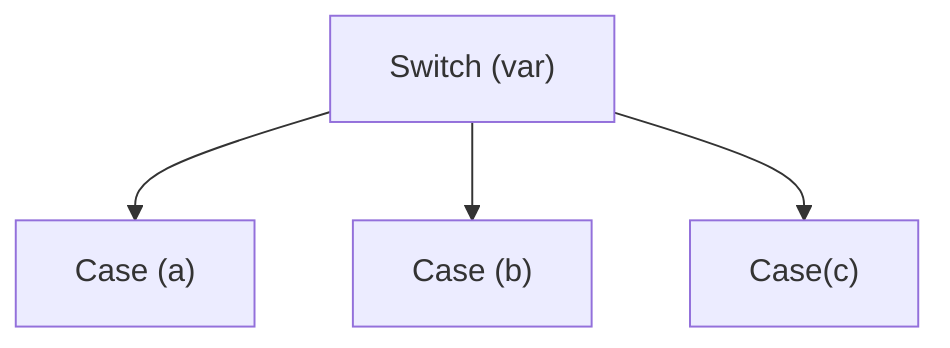

```java
switch (var) {
    case a: 
        /* Do something */ 
        break;
    case b: 
        /* Do something */ 
        break;
    case c: 
        /* Do something */ 
        break;
    default:
        /* Default */
}
```
Case statements start with a colon (:), each switch statements also includes a "default" case (Else statement).

// Overview

### Why conditional statements are useful?
+ It adds a variability to programming.
+ If a user does something, we want to be able to **adapt** accordingly.
+ Without it, the program would run the same way.

## Arrays
Variables are very good at storing **singular bits of information**, but they are unable to hold **more than one** piece of data.

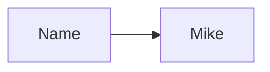

An array is a **list** of **something**, it can be Integers, Strings, or even an array. 

+ All information in an array is related.

+ Like columns in Excel or Google Sheets

// an image of an excel grocery list

An array is very useful when programmers wants to store a lot of information that can be easily to search through.

Example, if we have a Facebook-like program with 100,000 users. Every time a person wants to create a new username, we want to check to see if the account name has already been taken.

// Image of usernames

The **single most important thing to note about arrays** is **how we reference each element inside of them**.

Numbers | 1 | 2 | 3 | 4 | 5 | 6
----------|---|---|---|---|---|---
Index | 0 | 1 | 2 | 3 | 4 | 5

To reference each element inside of them, we use index, a numbers **"place"** in the array.

The array indexing starts at 0, that means to access the first element in the array, we use index 0, because the first element is placed at index 0.

It is weird and confusing, but this is the one that you have to memorize and commit to memory. If you slip up and accidentally reference the 6th index in this array, it will result in an **OutOfBoundsException**.


### Creating an array
To create an array, you insert the elements you would like in the array **immediately**. Or you create an array with a specific size, but choose to **add elements later**.

When we create array, their sizes are **FINAL**. It cannot **increased** or **decreased** in size through conventional methods. This is what allows us to easily access their indexes.

When initializing an array, you must determine its type and they all have to be the same type. Which means you cannot mix and matches the type of the array. As example of mix and match:

Username|
-------|
Sean
Mike
10
Isaac
True
False

Which are not allowed in the array.

### Multi-dimensional Arrays
Putting an **array inside an array** is known as 2 dimensional array, or multi-dimensional array.

Index | Names | | | | |
------| -------|--|--|--|--|
0| Alex | Arnold | Ael | Ash | Ariel
1| Bob | Ben | Billy | Boan | Baly
2| Clint | Carry | Cal | Colton | Crab

To index 2D arrays, we use 2 numbers. **First number** is the row, **second number** is the column.

Index | 0 | 1 | 2 | 3 | 4 |
------| -------|--|--|--|--|
0| Alex | Arnold | Ael | Ash | Ariel
1| Bob | Ben | Billy | Boan | Baly
2| Clint | Carry | Cal | Colton | Crab

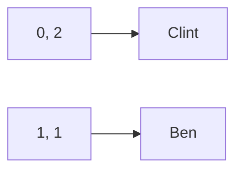

You can have more dimension to an array, but 2 dimensional array is fairly enough for programming.

Example code of using an array
```java
int[] arr = { 20, 10, 40, 50 };
System.out.println(arr[2]); // 40

String[] names = { "Alex", "Ash", "Ariel" };
System.out.println(names[1]); // Ash

int[][] moreNames = { 
    { "Alex", "Arnold", "Ash", "Ariel" },
    { "Bob", "Ben", "Billy", "Boan" },
    { "Clint", "Carry", "Cal", "Crab" },
};
System.out.println(moreNames[1][2]); // Billy
```

## Loops
How we can have a code that repeat a block without repeating to write more lines of code.

We could simply loop the code over and over again.

### What is a Loop?
A **Loop** is a **statement that is used to run certain instructions repeatedly**. Very useful for repeated sections of the code.

If we wanted to print something 15 times, we could use 15 print statements.

```java
System.out.println("Hello World");
System.out.println("Hello World");
System.out.println("Hello World");
System.out.println("Hello World");
System.out.println("Hello World");
System.out.println("Hello World");
System.out.println("Hello World");
// ..
```

Or we could use a loop, allows us to repeat parts of code multiple times.

```java
for (int i = 0; i < 15; i++) {
    System.out.println("Hello World");
}
```

### For Loops
For loops is used when you would like to carry out a certain set of instructions **numerous times**.

Consists of **3 parts**
+ An **integer value**
+ A **conditional statement** to must be evaluate to exit the loop.
+ An operation to **modify** the integer value **after** the instructions inside of the loop are completed.

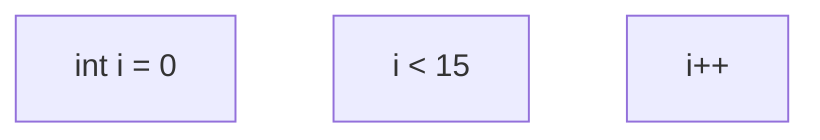

### Caution:
When using a for loop, you **MUST** make sure you set up a condition that, **given the initial integer** value and the **operation**, will at some point be met. Otherwise, it will cause an **infinite loop**.

```java
for (int i = 10; i > 0; i++) {}
```

An integer starting at 10, and only increasing will never be less than 0.

### Foreach Loop
Foreach loop is used for **iterating** through entire **arrays** or **lists** by going through each **element** in the array and carry out a **set of instructions** for each value.

Useful for **performing operations** across **entire collections** of data.

Example pseudocode:
```
seq = [18, 20, 32]
for each x of seq
    print x
end
```
Example in Java:
```java
int[] seq = { 18, 20, 32 };
for (int s : seq) {
    System.out.println(s);
}
```

### While loop
While loop will **continually** carry out its instructions while **a conditional statement** given to it is true. Similar to a for loop, but simplier.

It can sometimes be used to purposely create an **infinite loop**.

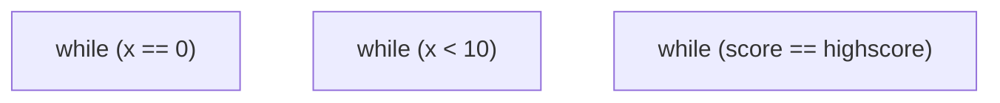

Example of using while loop as a for loop:
```java
int i = 0;
while (i < 15) {
    System.out.println("Hello World");
    i++;
}
```

Example for purposely using a infinite loop for a game:
```java
while (true) {
    playGame();
}
```

This line of code runs a game infinitely in a loop, which can be also called a game loop.

### Do-While loop
Do-While loop functionality similar to a while loop, however will **always** carry out instructions **AT LEAST ONCE**.

Instructions inside loop will run once **before checking the conditional statement**.

// Example image of do while loop

```java
int x = 0;
do {
    System.out.println("Hello World");
    x++;
} while (x < 5);
```

// Overview

Benefits of **Loops**
+ Perform operations many times **in a row**.
+ Able to **iterate** through arrays and lists.
+ Decrease **clutter** of your code.

## Functions
How can we reuse code to make our program more space-sufficient and easy to read?

We've actually been using **functions** the whole time, one of which is the **print functions**, and **basic math operators**.

```java
public static void main(String[] args) {
    System.out.println("Hello World");
    int x = 10 + 20;
}
```

### What are functions?
A **function** is a block of code that can be called easily by calling its name. Depending on the type of function, **may do something** in return.

Can be called **numerous times**, and in **numerous places**. Like wrapping code into a **present** and giving it a name.

We **"call"** the print **function**, and enter in what we want to be printed to the console **inside the parenthesis**.
```java
System.out.println("This will be printed");
```

Behind the scenes, there is **more code**, which takes care of printing our message to **the console**, **abstracts** all that code down to a **single line**.

Functions serve **many purposes**, used to **recycle** sections of code which serve the same purpose, used for **equations** you want to allow multiple inputs of, and used to save **space** within your program.

```calculus
f(x) = 2x^2 + 3x + 5
```

```java
float f(float x) {
    return Math.pow(2 * x, 2) + (3 * x) + 5;
}
```

There are **thousands** of types of function that built for us, including on what we use on the example before, the `Math.pow()`. Often times you will just **import** the ones you need in your program.

// images

There are 4 different **types** of **functions**.
+ Separated by whether or not they **take in arguments**.
+ Separated by whether or not they **return values**.

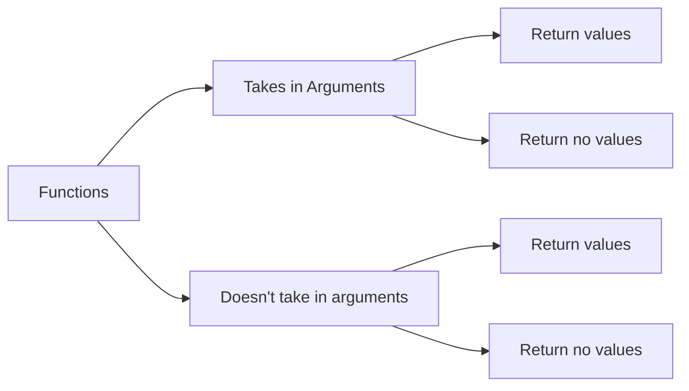

### Function with arguments
Arguments are **variables** we **pass into a function** in order to be manipulated and then either:
+ **Returned** back to us.
+ **Printed** to the console.
+ Used in another **operation**.

Let's look at the **Max function**:
```java
int maxNumber = Math.max(1, 100);
int maxNumber = Math.max(60, 2);
int maxNumber = Math.max("Steve", "Max");
```
```
maxNumber = 100
maxNumber = 60
ERROR: Arguments expected Integer, found String.
```

It takes **two arguments** (two **integers**) and returns the **higher** one.

Arguments are a way for programmers to have one function that **can do many different things**. 

Adds **variability** to programming and helps **diversify** your code.

### Functions without arguments
Think of the scenario where you want something that **prints our profile**.

You may have a code like this:
```java
System.out.println("Name: " + name)
System.out.println("User Name: " + userName)
System.out.println("Age: " + age)
System.out.println("City: " + city)
```
And you want to do this like 5 or more times in your application.

You might want to pack it in the function which we can reuse and prints our profile without having to print it all manually.

```java
void printProfile() {
    System.out.println("Name: " + name)
    System.out.println("User Name: " + userName)
    System.out.println("Age: " + age)
    System.out.println("City: " + city)
}
```
And use it without having to write everything manually:
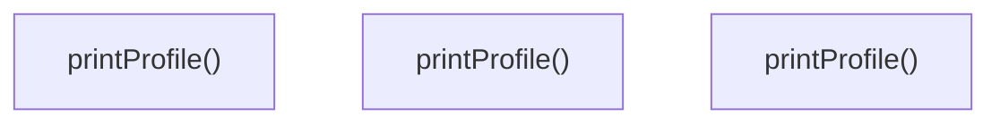

### Return values
Functions can either **return** variables or not. Returning something simply means the function will **return back to the user** something. A String?, Integer?, Array?, etc.

Returning functions **MUST** be returned **INTO** something, usually a **variable** but can also be printed.

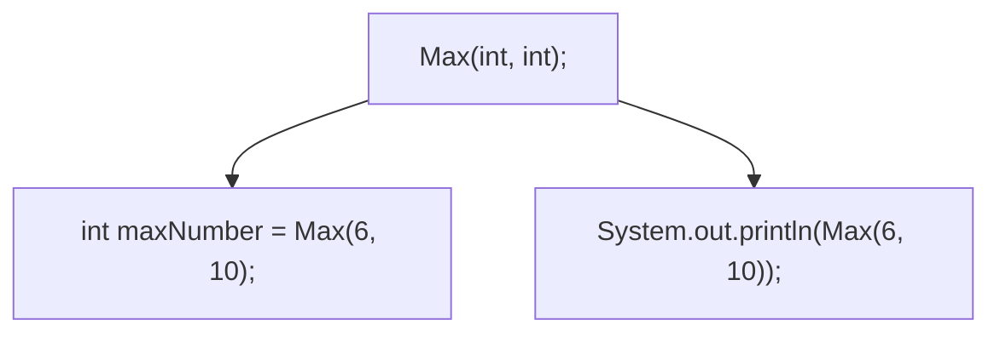

Another example, if we have our own function which is `combineString()` which combine two string in an arguments together, and return them into a singular string.
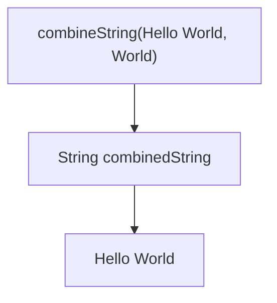

We can also use the returned value of a function to be an arguments. Which is calling a function inside of an arguments.

```java
String combinedString = combineString("Hello ", combineString(" World", ", Love You"));
System.out.println(combinedString) // Hello World, Love You
```

### No Return or No Arguments
A function which takes **no arguments** and returns **no values** is similar to the `printProfile()` function. It cannot be set to any variable since it returns no value.

```java
void printProfile() {
    System.out.println("Name: " + name)
    System.out.println("User Name: " + userName)
    System.out.println("Age: " + age)
    System.out.println("City: " + city)
}
```

### Adaptability of functions
Functions are super useful for making **large changes** to your code **easily**.
+ Each function call is just a **copy** of that functions code.
+ Changing the function will change **all future calls** of that function.

### How can we import functions?
How can we use already created functions to our benefit, without creating them ourselves?

Imagine if we want to build a house, for that we need to plant and cut down a trees, make your own tools and nails from scratch. But why do that? When you can just simply go to our local home depot and buy these materials that are already made it for you.

**Importing functions** allows you to gain access to libraries of **pre-made functions**. These are **thousands** of already made functions at your disposal.

In each programming languages, it allows you to use an `import` keyword, to `import` certain things from other packages and libraries.

Libraries are **collection** of functions that all have the **same theme**. Math library, Data analysis library, etc.


### Creating your own functions
There are going to be moments where you want to **create** your own functions. There are **Basic rules** you must follow.

Function naming conventions follow **Variable naming convention**.
+ Cannot be two words.
+ Often follow **PascalCase** structure. (or in Java, just **camelCase**).

**You cannot use these:**
```java
public void add Numbers() {}
```

```java
public void add-Numbers() {}
```

**You can use this:**
```java
public void addNumbers() {}
```

Each language **differentiates** how you tell the computer you are about to make a function.

In **Java**, first you have to define the function's **scope**, which is `public`, `private`, or `protected`. Then determine its **return type**, if the function does not return any value, just mark it as `void`. Next is the **function name**. And then, the set of parenthesis where you put your arguments.

The way to put an arguments is by typing the ype first, followed by the name. If you want to put more than one arguments, you will have to put comma.

Example of a function that returns a value with two arguments:
```java
public String combineString(String first, String second) {
    return first + second;
}
```
Example of a function that doesn't return any value:
```java
public void printHello() {
    System.out.print("Hello");
}
```

There is some differences between in other language to create a function, for example in python, you have to write `def`, short for define, followed by the **function name** and a set of parenthesis. In python, there is no need for type if we want to add more arguments to it and a return value.

```python
def printHello():
    print("Hello")

def add(x y):
    return x y
```

### Calling a functions you made
When you **call** a function, you **HAVE** to pass in it's designated variables types.

Example calling if we define an `add` function which takes two integers:

```java
int add(int x, int y) {
    return x + y;
}
```

We call it exactly with the given arguments:
```java
int x = add(20, 10); // 30
int y = add(10, 10); // 20
```

If we put a wrong type to the function, we will get an error.

### Returning functions
The most important thing to remember about making functions that returns variables is that **no matter what** path your code takes, it **MUST** return a variable.

Let's say you have a slope function which will take **4 floats** as an **argument** and also **float** as a return type.

```java
public float slope(float x1, float y1, float x2, float y2) {
    float x = x2 - x1;
    float y = y2 - y1
    return y / x
}
```
It would be very easy to write it when there's only one path to the function.

However, if we have like many path in the function, we must also have to **return** in that path as well.

For example, if we want to congratulate our player by having a score of 10 in a game:

```java
public String congratulatePlayer() {
    if (playerScore > 10) {
        return "Good Job!";
    } else {

    }
}
```

This code will not compile, and will result a compilation error, because we did not return all of possible path that the function could return. To fix this, we return all of the possible path.

```java
public String congratulatePlayer() {
    if (playerScore > 10) {
        return "Good Job!";
    } else {
        return "Keep Trying!";
    }
    // Does not need to return here since "else" take care of it.
}
```

Important to take note here is that you **cannot** return one type of variable if you have already defined the function to return **another type**.

### Importing libraries
Importing **libraries** is as simple as using an **import statement**, usually consists of the word "`import`" followed by the **library** you would like to import.

```java
import java.util.Scanner;
```
+ **java**: is a library.
+ **util**: is a package that is a smaller set of functions and methods to help differentiate between the thousands of functions contains in a library.
+ **Scanner**: is a class which allows us to read information from the user. It comes from the package of a java library.

If you don't know what **specific classes** you want to pull a method from, you can use **"*"**, and **all classes will be imported** from the package you like.
```java
import java.util.*;
```
If you are only using **one or two classes** from a package, it would be a waste of computing power to import the **entire library**.

### Finding functions to import
A simple Google Search will tell you if your **programming language** has a package that can fit your needs. If not, there are ways to **download additional packages**.

Credits to freecodecamp.org:
https://www.youtube.com/@freecodecamp