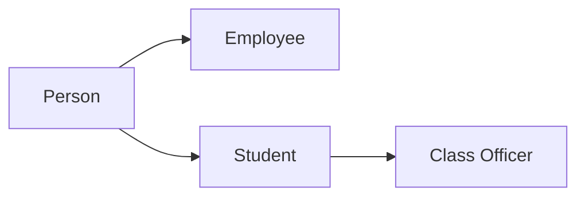
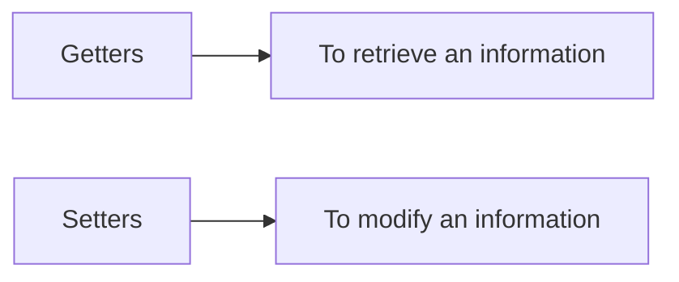

# Introduction to Object-Oriented Programming



We will explain OOP using its four main principles:
+ Encapsulation
+ Abstraction
+ Inheritance
+ Polymorphism

# Encapsulation
Encapsulation refers to **bundling data with methods** that can operate on that data within the class.

Encapsulation is the process of **hiding the implementation details of a class from the outside world**, preventing anything outside that class from directly interacting with it such as accessing and modifying. This does not mean that members of other classes cannot interact at all with the attributes fo another object, instead the members of other classes **can interact with the attributes of another object through its method**. 

## Methods

Remember, methods are a **functions that are defined within the class**. One way to make this works, is by creating a Getter and Setters method.



Doing this, you have provided a controlled way to access and modify the state of an object. By making fields private, we can ensure that they can only be access or modified through the appropriate methods, which can help prevent bugs and maintain the integrity of the object's state.

For example, if we have a role-playing game, I may have a two attributes for the player's health. a `maxHealth` and a `currentHealth`. When the character levels up, I may have their `maxHealth` increased as well. When this happen, I would want the `currentHealth` to be set to the `maxHealth`. Instead of changing it both of these values directly, I can define a new method called `SetMaxHealth()` method such as the `currentHealth` is set to the `maxHealth` when the `maxHealth` has increased.


The setter methods allows **both variables to be changed as the should**, rather than requiring you to individually change them.

Furthermore, these setter methods allows the input value to be validated, for instance if we can heal the player, we would not allow the player's `currentHealth` to bypass the limit of a `maxHealth`. For example:

The below example ensures that the variable is within the bounds of what is allowed.
```csharp
void SetCurrentHealth(int newHealth) 
{
    currentHealth = newHealth;
    if (currentHealth > maxHealth) 
    {
        currentHealth = maxHealth;
    }
}
```

You may also want some variables to be **"read only"** from the outside of the class, which means you will only **define a getter method but not the setter method**. The variable can only be referenced, **not changed**.


// TODO Some example here about validation with getter method

## Information Hiding
Information hiding, or keeping the data of one classes from external classes hidden. It helps you to **keep control of your program** and prevent **from becoming too complicated**.

It is consider the best practice to not allow **external classes** to **directly edit an object's variables**, this is very important when working on a large and complex programs. 

Encapsulation is a vital principle in Object Oriented Programming to maintain and control the access of their data, and prevent their program from ending up in being overall too complex.


# Abstraction