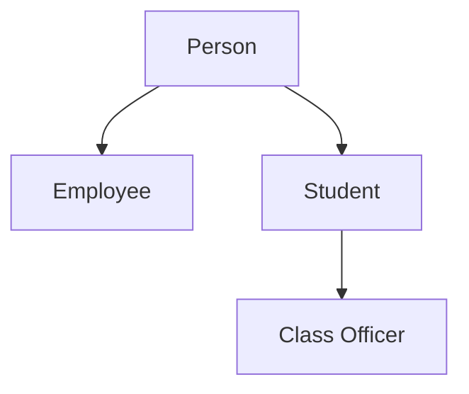
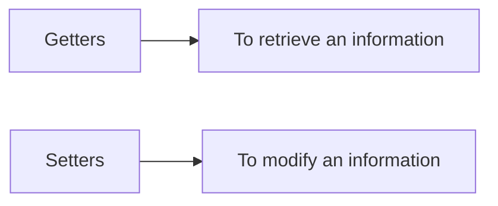
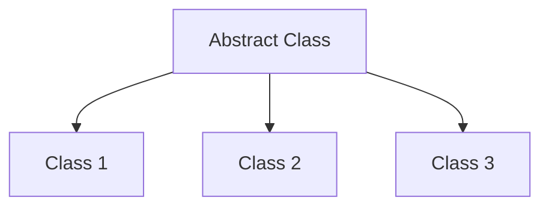
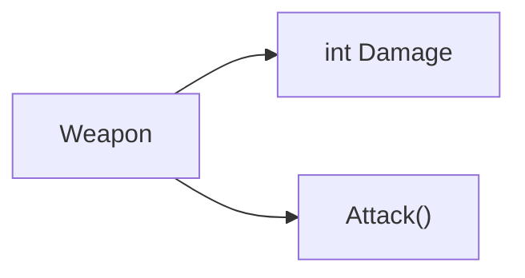
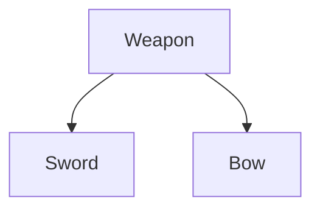
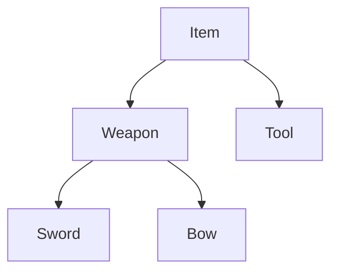
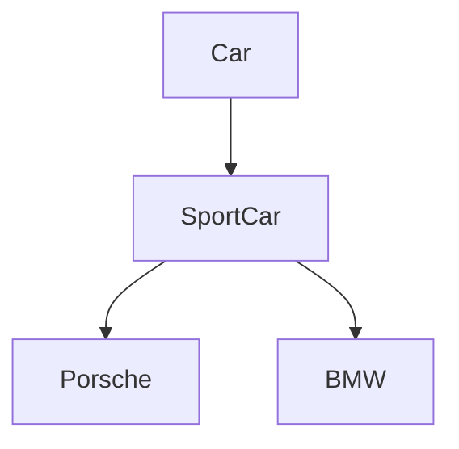

# Introduction to Object-Oriented Programming



We will explain OOP using its four main principles:
+ Encapsulation
+ Abstraction
+ Inheritance
+ Polymorphism

# Encapsulation
Encapsulation refers to **bundling data with methods** that can operate on that data within the class.

Encapsulation is the process of **hiding the implementation details of a class from the outside world**, preventing anything outside that class from directly interacting with it such as accessing and modifying. This does not mean that members of other classes cannot interact at all with the attributes fo another object, instead the members of other classes **can interact with the attributes of another object through its method**. 

## Methods

Remember, methods are a **functions that are defined within the class**. One way to make this works, is by creating a Getter and Setters method.



Doing this, you have provided a controlled way to access and modify the state of an object. By making fields private, we can ensure that they can only be access or modified through the appropriate methods, which can help prevent bugs and maintain the integrity of the object's state.

For example, if we have a role-playing game, I may have a two attributes for the player's health. a `maxHealth` and a `currentHealth`. When the character levels up, I may have their `maxHealth` increased as well. When this happen, I would want the `currentHealth` to be set to the `maxHealth`. Instead of changing it both of these values directly, I can define a new method called `SetMaxHealth()` method such as the `currentHealth` is set to the `maxHealth` when the `maxHealth` has increased.


The setter methods allows **both variables to be changed as the should**, rather than requiring you to individually change them.

Furthermore, these setter methods allows the input value to be validated, for instance if we can heal the player, we would not allow the player's `currentHealth` to bypass the limit of a `maxHealth`. For example:

The below example ensures that the variable is within the bounds of what is allowed.
```csharp
void SetCurrentHealth(int newHealth) 
{
    currentHealth = newHealth;
    if (currentHealth > maxHealth) 
    {
        currentHealth = maxHealth;
    }
}
```

You may also want some variables to be **"read only"** from the outside of the class, which means you will only **define a getter method but not the setter method**. The variable can only be referenced, **not changed**.


// TODO Some example here about validation with getter method

## Information Hiding
Information hiding, or keeping the data of one classes from external classes hidden. It helps you to **keep control of your program** and prevent **from becoming too complicated**.

It is consider the best practice to not allow **external classes** to **directly edit an object's variables**, this is very important when working on a large and complex programs. 

// Overview

Encapsulation is a vital principle in Object Oriented Programming to maintain and control the access of their data, and prevent their program from ending up in being overall too complex.


# Abstraction
Abstraction refers to **only showing the important details** and keeping everything else hidden.

This idea is present in our everyday lives, which of it when we are using our cellphone. **We do not need to know the internal workings** of the device, we just interact with it through a graphical user interface (GUI) which abstracts away the complex inner workings of the device.

This idea extends to object-oriented programming, the classes you create should act like your cellphone. **Users of your classes should not worry about the inner details of those classes.**

Abstraction is similar to encapsulation, classes should **not directly interact** with other classes' data.

This is very useful approach when working on your program incrementally. It helps you to create more features on your program more manageable. 



Modern programs are very complex to the point where **multiple programmers tend to work on one program**. In this case, it's best if the section that you work on is able to function without the knowledge of the inner workings of your teammate's section.

To achive this, it is important to know about interfaces and implementation.

## Interface
**The interface** refers to the way sections of code **can communicate with one another**. This typically done through methods that each class is able to access.

**The implementation** of these methods, or how these methods are coded, should be hidden within the class.

Example, if you open the app in your cellphone, the app immediately opened without knowing how it was opened.


If classes are **entangled**, then one change creates a **ripple effect that causes many more changes** to your program. Creating an interface through which classes can interact ensures that **each section can be individually developed**.

// Overview

This concept of abstraction allows developers **to create more complex systems without overwhelming users with unnecessary details**. It prevents the program from becoming entangled and complex, and allows to add more features to your program incrementally.

Determine a **specific contact** that can act as an interface between classes, and only **worry about the implementation when coding it**.

# Inhertiance
**Inheritance** is the principle that allows classes to derive from other classes. Classes can inherit a certain methods or variables from another class.

Example when we are programming a game, we have a class called Weapon, in this game, we have a weapon to fight to our enemy. Weapon class contains a methods and variables common to all weapons. 

For instance, the variable that represent a damage deal, and a method that represent the attack that deals damage to an enemy.



Then you want more classes to represent the specific classes like sword or bow. These classes would act differently from one another such as the sword have a sharp `damageType`, but the bow has range `damageType`, **but it still has the variables and methods** that the weapon class had, and share much of the same behaviour.



In this case, the Weapon is the **super class**, and the Sword and Bow are the **sub class** that extends the weapon class. 

Many of the variables and the methods that are associated with the super class are also be present in the sub classes.

Any sword or bow would require the variables and methods present in the weapon class in order to function. In most cases the **class hierarchy** you create will have many more layers with many more classes in each layer.

Maybe, the weapon class is a sub classes of a super class called Item which may also be a sub classes of an another super class, and may also be a sub classes of an another super class, and so on.



The **class hierarchy** acts as a web of classes with different relationships to one another.

## Access Modifier
Access modifers change which classes have access to the other classes, methods or variables.

There are three main access modifiers:
+ Public
+ Private
+ Protected


**Public members** can be accessed from anywhere in your program. This includes anywhere both inside of the class hierarchy, as well as the outside in the rest of the program.

**Private members** are accessible only inside of its class that the member is defined. 

This allows you to create multiple private members of the same name in different locations, so that they do not conflict with one another.

**Protected members** are accessible inside of its class that the member is defined, as well as any subclasses of that class. Protected members are private to the hierarchy in which they are defined.

# Polymorphism
Polymorphism describes **methods that are able to take on many forms**.

There are two types of polymorphism, the first one is **dynamic polymorphism**. Dynamic polymorphism occurs **during the runtime** of the progarm.

## Dynamic Polymorphism

This type of polymorphism describes when a **method signature is present in both a subclass and a superclass**. The methods share the **same name** but have **different implementation**. The implementation of the subclass that the object is an instance of overrides the superclass.

Car | SportCar 
------|--------- |
Drive(miles) | Drive(miles)
gas -= 0.04 * miles| gas -= 0.02 * miles

If you create an instance of a SportCar, the gas will decrease 0.02 gallons of gases per miles.
```csharp
SportCar mySportsCar = new SportCar();
mySportsCar.drive();
```


If you create an instance of a Car, the gas will decrease 0.04 gallons of gases per miles.
```csharp
Car car = new Car();
car.drive();
```

This works because of the **form of the method** is decided **based on level of where in the class hierarchy is called**. The implementation of a method signature that will be used is **determined dynamically as the program runs**.

You can add more subclasses to representing different types of sports cars, with their own drive methods from every implementations.



The main benefit of dynamic polymorphism is that is allows you to write more methods in the super class without having to include many conditional statements such as if, else if, and else statements or even switches, being used when the method is called.

## Static Polymorphism